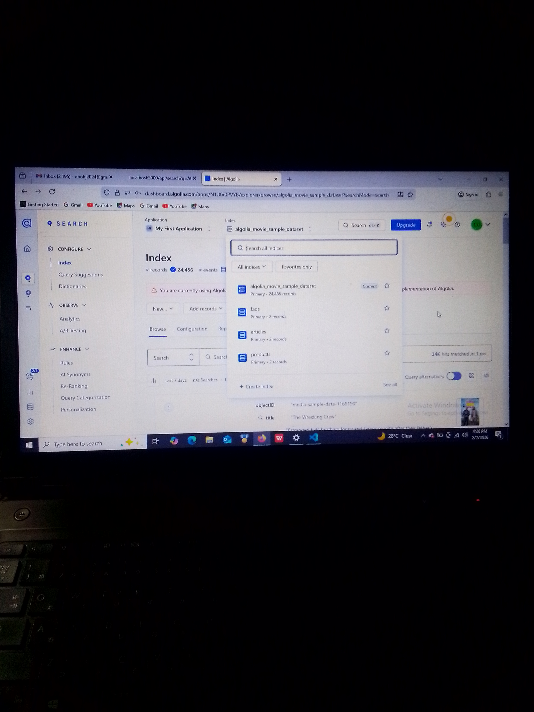

# SmartFind AI 🔍🤖  
**Algolia Agent Studio Challenge Submission – Consumer-Facing Conversational Experience**

SmartFind AI is a consumer-facing AI search assistant that combines **fast, multi-index retrieval powered by Algolia** with a **conversational interface**.  
It allows users to search across **products, articles, and FAQs**, retrieve relevant results in real time, and interact with an AI-style chat interface — clearly demonstrating *retrieve-before-respond* behavior.

This project was built specifically for the **Algolia Agent Studio Challenge** to showcase how intelligent, data-driven agents can power modern user experiences.

---

## 🚀 Key Features

- 🔍 **Multi-index Algolia Search**
  - Products
  - Articles / Knowledge base
  - FAQs
- ⚡ **Fast & Relevant Retrieval**
  - Uses Algolia’s hosted search infrastructure
  - Parallel queries across indices
- 🤖 **Conversational UI**
  - Chat-style interface for user interaction
  - Clear separation of chat vs retrieval logic
- 🧠 **Agent-style Flow**
  - Accept user input
  - Retrieve relevant data from Algolia
  - Reason over results
  - Respond intelligently
- 🌐 **Full-Stack Implementation**
  - Node.js + Express backend
  - React frontend (Vite)

---

## 🧠 Agent Flow (High Level)

1. User enters a query (search or chat)  
2. Backend queries Algolia indices (products, articles, FAQs)  
3. Results are retrieved in real time  
4. Frontend displays structured results  
5. Conversational layer enables follow-up interaction  

This design ensures **retrieval happens before response**, aligning with best practices for AI agents.

---

## ⚠️ Graceful Fallback Behavior

SmartFind AI responds gracefully when no relevant records are found. This demonstrates robust fallback behavior and ensures the system **never fails silently**.  

> **Important Note:**  
> SmartFind AI retrieves results only from **data currently indexed in Algolia**.  
> - If only **sample data** has been pushed, queries outside of that dataset (e.g., real-world products or articles not in the sample) will trigger the fallback response:  
> _"I couldn't find relevant products or information. Try another request."_  
> - To get meaningful results, ensure your **Algolia indices (products, articles, FAQs) are populated with real or expanded data**.  

#### 💡 Suggested Sample Queries (based on sample dataset)
- **Products:** `action movie`, `The Wrecking Crew`  
- **Articles:** `movie reviews`, `behind the scenes`  
- **FAQs:** `how to use SmartFind AI`, `search tips`  

Once your indices are populated with your own data, SmartFind AI will return **accurate, relevant results** for these and similar queries.

---

## 📸 Screenshots & Demo

### Algolia Dashboard (Indices & Records)
_Click to view full image_

[](screenshots/algolia-dashboard.png)

Shows:
- Products, Articles, and FAQs indices
- Sample records indexed in Algolia
- Search-ready configuration

---

### Chat & Search Interaction
_Click to view full image_

[](screenshots/chat-interaction.png)

Shows:
- User query input
- Backend-powered search retrieval
- Conversational AI-style response

---

### 🎥 Demo GIF / Video (Optional but Powerful)

**Short demo showing end-to-end flow:**
- User enters a query
- Backend retrieves from Algolia
- Results are returned conversationally

If using a GIF (recommended for GitHub):


If using a video instead (Loom / YouTube):

🔗 Demo Video: https://your-video-link-here

---

## 🗂️ Project Structure

smartfind-ai/  
├── backend/  
│   ├── server.js  
│   ├── agent/  
│   │   ├── algoliaClient.js  
│   │   ├── searchService.js  
│   │   ├── reasoningService.js  
│   │   └── responseComposer.js  
│   ├── routes/  
│   │   ├── chat.js  
│   │   └── search.js  
│   ├── scripts/  
│   │   └── seedAlgolia.js  
│   ├── .env  
│   ├── package.json  
│  
├── frontend/  
│   ├── src/  
│   │   ├── App.jsx  
│   │   ├── components/  
│   │   │   ├── ChatWindow.jsx  
│   │   │   └── ChatInput.jsx  
│   │   └── services/  
│   │       └── api.js  
│   ├── index.html  
│   └── package.json  
│  
└── README.md  

---

## ⚙️ Tech Stack

**Backend**
- Node.js
- Express
- Algolia JavaScript Client
- dotenv
- Nodemon

**Frontend**
- React
- Vite
- Fetch API

**Search Infrastructure**
- Algolia (multi-index search)

---

## 🔐 Environment Variables

Create a `.env` file in the `backend/` directory:

```env
ALGOLIA_APP_ID=your_algolia_app_id
ALGOLIA_API_KEY=your_algolia_search_api_key
PORT=5000
ALGOLIA_PRODUCTS_INDEX=products
ALGOLIA_ARTICLES_INDEX=articles
ALGOLIA_FAQS_INDEX=faqs
